--- 
author: Piotr Zawadzki
title: "Ramki w GNU Radio"
lang: polish
marp: true
math: mathjax
theme: polsl
size: 16:9
paginate: true
backgroundImage: url("img/normal-page-background.png") 
transition: fade
header:
footer: "**Ramki w** "
---
<!-- _class: titlepage -->
<!-- _backgroundImage: url("img/title-page-background.png") -->
<!-- _paginate: false -->
<!-- _footer: "" -->
##

##

##

##

##
###

# Ramki w 

### Nadawanie i odbiór asynchroniczny

### Piotr Zawadzki

### 24.03.2024 
---
## Założenia

#### Tylko warstwa łącza
- Nie opuszczamy abstrakcji bitów.
- Brak odwołań do symboli
- Nie ma modulatorów i demodulatorów kanałowych
  
##### Jednak schemat końcowy jest strukturalnie zgodny z nadajnikiem i odbiornikiem OFDM!

---
## Czego mi brakowało w GNU Radio
i co musiałem dorobić

#
- Blok, który okresowo wysyła ramkę o treści zadane przez użytkownika - `QT GUI Message PDU Gen`,
- Model kanału BSC,

#

#### Jak dodać blok OOT do swojego Gnuradio Companion

1. Wczytać plik schematu bloku do *Gnuradio Companion*.
1. Wygenerowć "flowgraph".
1. Bloki OOT są dostępne w kategorii `GRC Hier Blocks`.

#

#

---
## `npkt_00.grc` Nadajnik i odbiornik zwarte na krótko

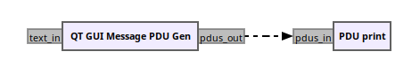

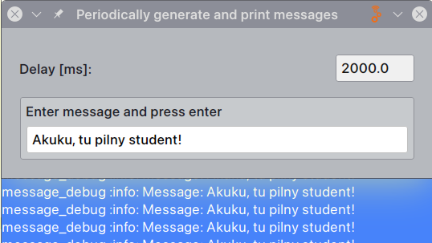

  Nadajnik okresowo produkuje wiadomości,
które są następnie drukowane.

- PDU są wewnętrznie reprezentowane jako para:
- słownik reprezentujący metadane skojarzone z ramką,
- wektor bajtów.
 
Każdy z tych elementów składowych oraz samo PDU są reprezentowane jako typ Polymorphic Type (PMT) zdefiniowany w Gnuradio

---
## `npkt_01.grc` Dodano kanał BSC
Można obserwować wpływ BER na jakość przesyłanych komunikatów. - wystarczą pojedyncze procenty.

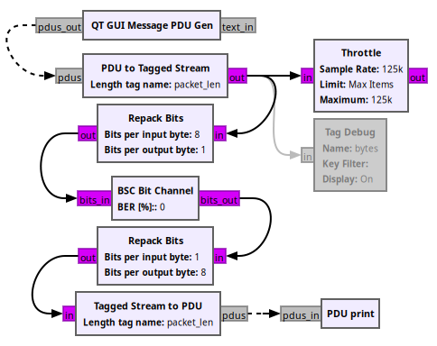

- Gdy nie ma źródła sprzętowego `Throttle` jest konieczny.
- Odbiornik pracuje na strumieniu danych.
- Gdy nie ma modułu zapewniającego synchronizację to należy ją zapewnić w sposób sztuczny.
- Do pierwszego bajtu pakietu dodawany jest znacznik (tag) zawierający jego długość (`PDU to Tagged Stream`).
- `Repack Bits` zapewnia serializację i de-serializację.
- W kanale obowiązuje sieciowy (MSB) porządek bitów 
  (*teraz to bez znaczenia, ale bloki realizujące synchronizację spodziewają się właśnie takiego uporządkowania bitów*).
- Odzyskanie synchronizacji (dzięki znacznikowi `packet_len`) zapewnia `Tagged Stream to PDU`.

---
## `npkt_01.grc` Technikalia
###

#### Znakowanie danych
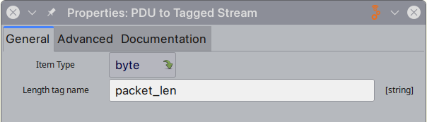

#### Model kanału
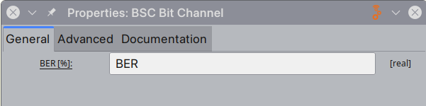

#### Serializacja
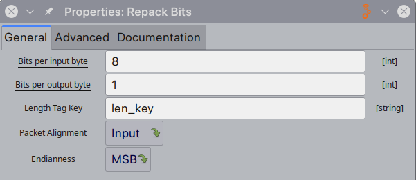

##### Ze względu na wewnętrzne buforowanie zmiana BER *w locie* jest dyskusyjna - zmiana jest widoczna dopiero po pewnych czasie

###
###

---
## `npkt_02.grc` Stopień detekcji błędów

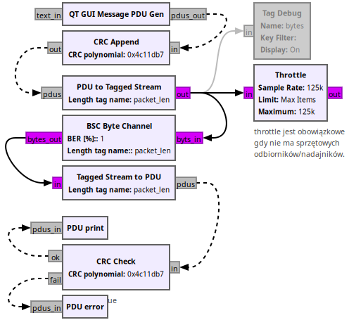

* `BSC Byte Channel` objemuje bloki realizujące serializację danych,
* Szkody są duże, dla $BER=1\%$ prawie każdy pakiet jest błędny,

##### Kodowanie nadmiarowe jest niezbędne.

* *bloki `Async CRC16` i `Async CRC32` są **przestarzałe** od **wersji 3.10**.*
  

---
## Kodowanie nadmiarowe w GNU Radio

#

### `Payload Encode`

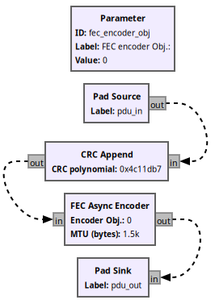

* `FEC Async Encoder` aplikuje kod korekcyjny do PDU,
* Definicja kodera dla konkretnego jest zewnętrzna w stosunku do bloku,
* Należy zdefiniować zmienną (obiekt) kodera i przekazać jako parametr,
* Istnieją gotowe bloki konfigurujące obiekty koderów i pasujących do nich dekoderów: `Dummy ...`, `Repetition ...`, `CC ...`, `TPC ...`, `LDPC ...`, `Polar ...`,
  

#

###

###

---
## Dekodowanie jest trudniejsze

### `Payload Decode`

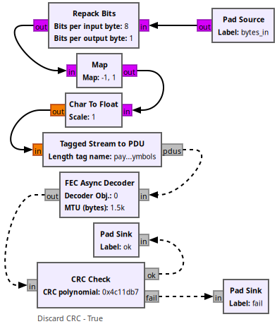

* `FEC Async decoder` pracuje na *miękkich* bitach,
* uporządkowanie bitów ma być zgodne z architekturą systemu (tutaj LSB),
* parametr `Decoder Obj.` musi być kompatybilny z obiektem kodera. 
  

#
###

--- 
## Transmisja z kodowaniem nadmiarowym

#

 

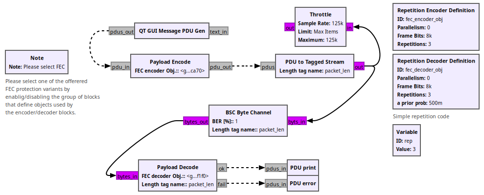 

Dla powtórzeniowego $r=3$ prawie wszystkie pakiety są bezblędne przy stopie $BER=1\%$. 

#

---
## Nagłówek

 

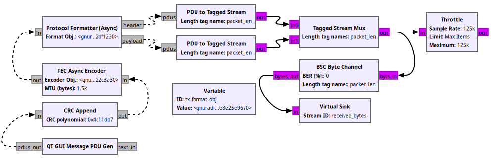

* Za uzupełnienie nagłówka odpowiada `Protocol Formatter (Async)`
* Za jego wyznaczenie odpowiada obiekt wyprowadzony z klasy `header_format_base`,
* Dostępne klasy `header_format_default`, `header_format_crc`, `header_format_ofdm` 

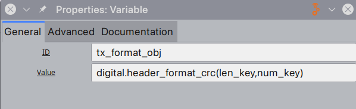

* `len_key="packet_len"`, `num_key="packet_num"`  

#
#

---
## Typy nagłówków

| `header_format_default` | $\le 64$ bits | 16 bits | 16 bits | |
| ---                     | --- | --- | --- | --- |
|                         | access code | pkt len | pkt len (repeated) | payload |

| `header_format_counter` | $\le 64$ bits | 16 bits | 16 bits | 16 bits | 16 bits | |
| ---                     | --- | --- | --- | --- | --- | --- |
|                         | access code | pkt len | pkt len (repeated) | bits/symbol | counter | payload |

| `header_format_crc`/`header_format_ofdm` | 0 - 11 | 12 - 23 | 24 - 31 |
| --- | --- | --- | --- |
|     | pkt len | counter | CRC8 |

* Nagłówki zawierające `access code` zakładają uporządkowanie sieciowe (MSB) uporządkowanie bajtów i bitów.
* Nagłówki bez `access_code` zakładają porządek zgodny z architekturą (czyli zazwyczaj LSB). Najwidoczniej zakłada się, że synchronizacja zostanie wykonana inaczej.
  

---
## Odbiór z zewnętrzną synchronizacją

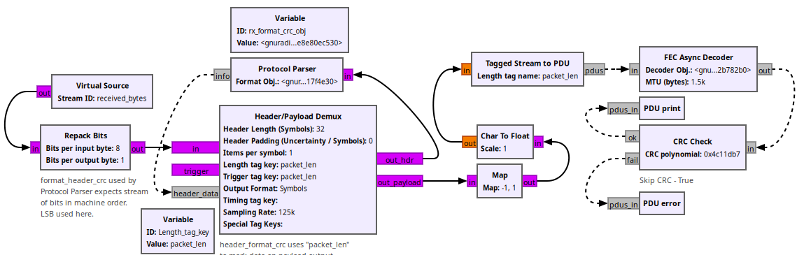

* Obiekt nagłówka `format_header_crc`, dane w trybie LSB, synchronizację zapewnia znacznik określony w `Trigger tag key`.
* Od momentu pojawienia się znacznika bity z `in` są wystawiane na `out_hdr` do `Protocol Parser` i podejmowana jest próba zdekodowania nagłówka.
* Zgodność CRC8 włącza interpretację pola długości danych.
* Na porcie `out_payload` wystawiany jest znacznik określony w `Length tag key` i zawierający zdekodowaną długość danych.
* Bity z wejścia `in` cały czas idą na `out_payload`, ale bez znacznika są odrzucane przez `Tagged Stream to PDU`.
  
#

#

---
## Synchronizacja na podstawie `access_code`

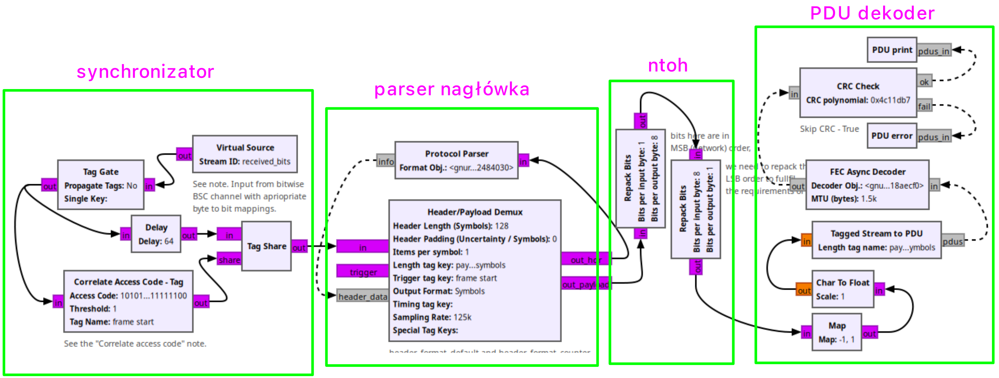

* `access_code=digital.packet_utils.default_access_code`
* `header_obj=digital.header_format_counter(access_code, 2,1)`

###
###

---
## Synchronizator z bliska

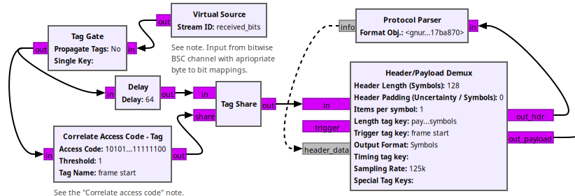

* celem jest wygenerowanie tagu gdy pojawi się odpowiednia sekwencja bitów: `frame_start`,
* HPL wtedy prześle bity do obiektu nagłówka

* po znalezieniu i interpretacji pól nagłówka obiekt nagłówka na pierwszym bicie danych ustawi znacznik `payload_symbols`,
* trzeba jeszcze zmienić porząd bitów z sieciowego na natywny dla hosta

#
###

---
## OFDM Synchronizer

#

 

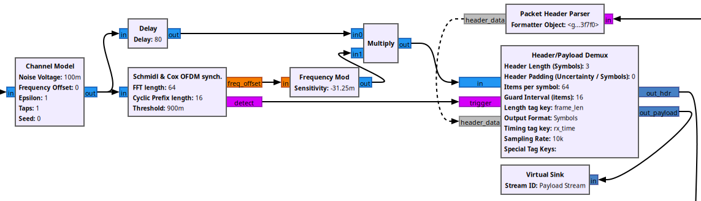

##### Synchronizator i dekoder nagłówka w OFDM są bardzo zbliżone do przedstawionego schematu

#

#

---
## OFDM Header Parser

 

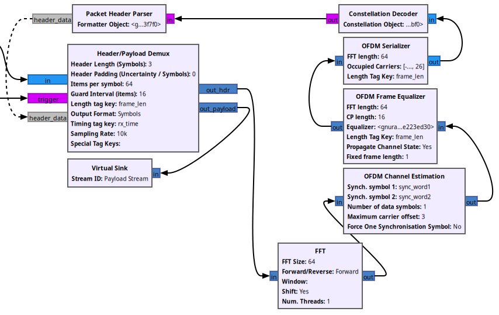

#

