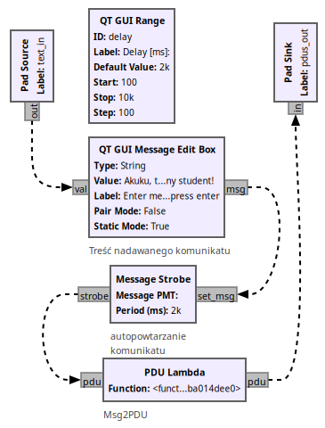
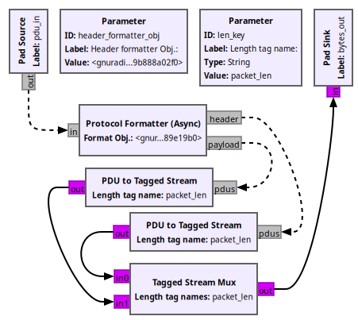

--- 
author: Piotr Zawadzki
title: "Ramki w GNU Radio"
lang: polish
marp: true
math: mathjax
theme: polsl
size: 16:9
paginate: true
backgroundImage: url("img/normal-page-background.png") 
transition: cube
header:
footer: "**Ramki w** "
---
<!-- _class: titlepage -->
<!-- _backgroundImage: url("img/title-page-background.png") -->
<!-- _paginate: false -->
<!-- _footer: "" -->
##

##

##

##

##
###

# Ramki w 

### Nadanie i odbiór asynchroniczny

### Piotr Zawadzki

### ostatnia aktualizacja: 6 maja 2024 r. 

   
---
## Założenia
#
#
#### Tylko warstwa łącza
- Nie opuszczamy abstrakcji bitów.
- Brak odwołań do symboli.
- Nie ma modulatorów i demodulatorów kanałowych.
  
##### Jednak schemat końcowy jest strukturalnie zgodny z nadajnikiem i odbiornikiem OFDM!
#
#

---
## Czego mi brakowało w GNU Radio

#

#### i co musiałem dorobić

- Blok, który okresowo wysyła ramkę o treści zadanej przez użytkownika - `QT GUI Message PDU Gen`.
- Blok wypisujący zawartość PDU jako string `PDU print`.
- Model kanału BSC.


#

#### Jak dodać blok OOT do swojego Gnuradio Companion

1. Wczytać plik schematu bloku do *Gnuradio Companion*.
1. Wygenerowć "flowgraph".
1. Bloki OOT stają się wtedy dostępne w kategorii `GRC Hier Blocks`.

#

---
## `npkt_00.grc` Nadajnik i odbiornik zwarte na krótko

#
<div class="columns">
<div align="center">


</div>
<div>

  Nadajnik okresowo produkuje wiadomości,
które są następnie drukowane.

PDU są wewnętrznie reprezentowane jako para:
- słownik reprezentujący metadane skojarzone z ramką,
- wektor bajtów.
 
Każdy z tych elementów składowych oraz samo PDU są reprezentowane jako typ Polymorphic Type (PMT) zdefiniowany w Gnuradio

</div>
</div>

---
## `npkt_01.grc` Dodano kanał BSC
Można obserwować wpływ BER na jakość przesyłanych komunikatów. 
<div class="columns">
<div align="center">


</div>
<div style="justify-self: center; align-self: center">

#### Wystarczą pojedyncze procenty.
- `Throttle` jest konieczny gdy nie ma źródła sprzętowego.
- Odbiornik pracuje na strumieniu danych.
- Gdy nie ma modułu zapewniającego synchronizację to należy ją zapewnić w sposób sztuczny.
- Do pierwszego bajtu pakietu dodawany jest znacznik (tag) zawierający jego długość (`PDU to Tagged Stream`).
- `Repack Bits` zapewnia serializację i de-serializację.
- W kanale obowiązuje sieciowy (MSB) porządek bitów 
  (*teraz to bez znaczenia, ale bloki realizujące synchronizację spodziewają się właśnie takiego uporządkowania bitów*).
- Odzyskanie synchronizacji (dzięki znacznikowi `packet_len`) zapewnia `Tagged Stream to PDU`.

</div>
</div>

---
## `npkt_01.grc` Technikalia
###
<div class="columns">
<div style="justify-self: center; align-self: center">

#### Znakowanie danych


#### Model kanału


</div>
<div style="justify-self: center; align-self: center">

#### Serializacja


##### Ze względu na wewnętrzne buforowanie zmiana BER *w locie* jest dyskusyjna - zmiana jest widoczna dopiero po pewnym czasie

</div>
</div>

---
## `npkt_02.grc` Stopień detekcji błędów
#
<div class="columns">
<div align="center">


</div>
<div style="justify-self: center; align-self: center" >

* `BSC Byte Channel` objemuje bloki realizujące serializację danych,
* Szkody są duże, dla $BER=1\%$ prawie każdy pakiet jest uszkodzony,

##### Kodowanie nadmiarowe jest niezbędne.

* *bloki `Async CRC16` i `Async CRC32` są **przestarzałe** od **wersji 3.10**.*
  
</div>
</div>

---
## Kodowanie nadmiarowe w GNU Radio

#


<div class="columns">
<div align="center">

### `Payload Encode`


</div>
<div style="justify-self: center; align-self: center" >

* `FEC Async Encoder` aplikuje kod korekcyjny do PDU,
* Definicja kodera dla konkretnego kodu jest zewnętrzna w stosunku do bloku `FEC Async Encoder`,
* Należy zdefiniować zmienną (obiekt) kodera i przekazać ją jako parametr,
* Istnieją gotowe bloki konfigurujące obiekty koderów i pasujących do nich dekoderów: `Dummy ...`, `Repetition ...`, `CC ...`, `TPC ...`, `LDPC ...`, `Polar ...`,
  
</div>
</div>

---
## Dekodowanie jest trudniejsze

<div class="columns">
<div style="justify-self: center; align-self: center">

### `Payload Decode`


</div>
<div style="justify-self: center; align-self: center" >

* `FEC Async decoder` pracuje na *miękkich* bitach,
* uporządkowanie bitów ma być zgodne z architekturą systemu (tutaj LSB),
* parametr `Decoder Obj.` musi być kompatybilny z obiektem kodera. 
  
</div>
</div>

--- 
## Transmisja z kodowaniem nadmiarowym

#

<div align="center"> 

 

</div>

Dla kodu powtórzeniowego $r=3$ prawie wszystkie pakiety są bezbłędne przy stopie $BER=1\%$. 

---
## Nagłówek

<div align="center"> 


</div>

<div class="columns">
<div style="justify-self: center; align-self: center">

* Za uzupełnienie nagłówka odpowiada `Protocol Formatter (Async)`
* Za jego wyznaczenie odpowiada obiekt wyprowadzony z klasy `header_format_base`,
* Dostępne klasy `header_format_default`, `header_format_crc`, `header_format_counter`, `header_format_ofdm` 


</div>
<div style="justify-self: center; align-self: center" >


* `len_key="packet_len"`, `num_key="packet_num"`  
</div>
</div>

---
## Typy nagłówków

##### Nagłówki zawierające `access code` zakładają uporządkowanie sieciowe (MSB) uporządkowanie bajtów i bitów.


| `header_format_default` | $\le 64$ bits | 16 bits | 16 bits | |
| ---                     | --- | --- | --- | --- |
|                         | access code | pkt len | pkt len (repeated) | payload |


| `header_format_counter` | $\le 64$ bits | 16 bits | 16 bits            | 16 bits     | 16 bits |         |
| ---                     | ---           | ---     | ---                | ---         | ---     | ---     |
|                         | access code   | pkt len | pkt len (repeated) | bits/symbol | counter | payload |


---
## Typy nagłówków

#

#

##### Nagłówki bez `access_code` zakładają porządek zgodny z architekturą (czyli zazwyczaj LSB). Najwidoczniej zakłada się, że synchronizacja zostanie wykonana inaczej.

| `header_format_crc`/`header_format_ofdm` | 0 - 11  | 12 - 23 | 24 - 31 |
| ---                                      | ---     | ---     | ---     |
|                                          | pkt len | counter | CRC8    |

#

---
## Odbiór z zewnętrzną synchronizacją


* Obiekt nagłówka `format_header_crc`, dane w trybie LSB, synchronizację zapewnia znacznik określony w `Trigger tag key`.
* Od momentu pojawienia się znacznika bity z `in` są wystawiane na `out_hdr` do `Protocol Parser` i podejmowana jest próba zdekodowania nagłówka.
* Zgodność CRC8 włącza interpretację pola długości danych.
* Na porcie `out_payload` wystawiany jest znacznik określony w `Length tag key` i zawierający zdekodowaną długość danych.
* Bity z wejścia `in` cały czas idą na `out_payload`, ale bez znacznika są odrzucane przez `Tagged Stream to PDU`.
  

---
## Synchronizacja na podstawie `access_code`


* `access_code=digital.packet_utils.default_access_code`
* `header_obj=digital.header_format_counter(access_code, 2,1)`

---
## Synchronizator z bliska

<div align="center"> 


</div>

<div class="columns">
<div>

* celem jest wygenerowanie tagu gdy pojawi się odpowiednia sekwencja bitów: `frame_start`,
* HPL wtedy prześle bity do obiektu nagłówka

</div>
<div>

* po znalezieniu i interpretacji pól nagłówka obiekt nagłówka na pierwszym bicie danych ustawi znacznik `payload_symbols`,
* trzeba jeszcze zmienić porządek bitów z sieciowego na natywny dla hosta

</div>
</div>

---
## OFDM Synchronizer

#

<div align="center"> 


</div>

##### Synchronizator i dekoder nagłówka w OFDM są bardzo zbliżone do przedstawionego schematu

---
## OFDM Header Parser

<div align="center"> 


</div>

---
## Moje bloki OOT, `BSC Bit Channel`

<div class="columns">
<div style="justify-self: center; align-self: center">


</div>
<div style="justify-self: center; align-self: center" >

### Kolejne kroki

1. `Random Uniform Source` generuje 16-bitową liczbę losową,
1. liczba jest skalowana na przedział $[-1;0]$,
1. przedział przesuwa się o $BER$: $b \in [-1+BER; BER]$
1. progowanie: $b>0 \to 1$, $b\lt 0 \to 0$, procent jedynek wprost proporcjonalny do BER,
2. gdy $b=1$ to bit wejściowy odwraca operacja xor. 

</div>
</div>

---
## Moje bloki OOT, `msg_pdu_gen`

<div class="columns">
<div style="justify-self: center; align-self: center">



</div>
<div style="justify-self: center; align-self: center" >

### Kolejne kroki

1. `QT GUI Message edit Box` pozwala na wprowadzenie treści komunikatu,
1. który jest powtarzany przez `Message Strobe` co zadany okres czasu,
1. Parametr `Message PMT` jest zainicjowany komunikatem pustym: `pmt.intern(b"")`,
1. Najważniejsza jest nienazwana funkcja `lambda`, w której na podstawie parametru `msg` jest tworzony PDU, czyli para złożona z pustego słownika oraz wektora bajtów.

</div>
</div>

```python
lambda msg: pmt.cons(pmt.PMT_NIL, pmt.init_u8vector(len(pmt.symbol_to_string(msg)), [ord(i) for i in pmt.symbol_to_string(msg)]))
```

---
## Moje bloki OOT, `msg_pdu_print`

<div class="columns">
<div style="justify-self: center; align-self: center">


</div>
<div style="justify-self: center; align-self: center" >

### Kolejne kroki

1. `PDU Split` oddziela metadane od danych w PDU,
5. Funkcja `lambda` konwertuje wektyor bajtów PMT na ciąg znaków,
6. A potem już tylko wydruk w konsoli.

</div>
</div>

```python
lambda u8vector: pmt.intern(''.join(chr(x) for x in pmt.u8vector_elements(u8vector)).encode())
```

---
## Moje bloki OOT, `Header Prepend`
###
###

<div class="columns">
<div style="justify-self: center; align-self: center">



</div>
<div style="justify-self: center; align-self: center" >

### Objaśnienie już było

Celem bloku jest tylko umożliwienie bardziej zwartej reprezentacji nadajnika.

</div>
</div>

---
## Moje bloki OOT, `Header Sync & Parse`

#


**Do poprawy!** Zmienna `Access Code` powinna być pobrana z obiektu nagłówka `hdr_format_obj`.

---
## Take away

Diagramy przepływu opracowano korzystając z poradnika [Packet Communications](https://wiki.gnuradio.org/index.php/Packet_Communications) znajdującego się w dokumentacji GnuRadio.

### Wnioski
1. Podczas implementacji diagramów przepływu należy **pilnie** zwrazać uwagę na uporządkowanie bitów:
   - bloki przeznaczone do pracy z danymi lokalnymi pracują na danych uporządkowanych zgodnie z architekturą systemu (w praktyce LSB),
   - bloki przeznaczone do pracy z danymi z sieci spodziewają się uporządkowania MSB.
    **Nieprzestrzegając tej reguły odnosi się wrażenie, że niektóre bloki tajemniczo nie działają - patrz wnioski pod powołanym wyżej poradnikiem**
1. Obsługa danych pakietowych wymaga zapoznania się ze interfejsem klasy Pythona _PMT_(Polymorphic Type) umożliwiającej enkapsulację różnych typów w tej samej strukturze.
2. Ramki/Pakiety są obsługiwane jako para PMT. Pierwszy element pary jest słownikiem zawierającym metadane w postaci `klucz->wartość`. Drugi element pary jest wektorem bajtów reprezentującym zawartość ramki.

---
## Uznania

#
[](https://www.gnuradio.org/)

#
Prezentacja jest dostępna pod adresem [https://pzktit.github.io/Ramki_w_Gnuradio/](https://pzktit.github.io/Ramki_w_Gnuradio/)

#

Do jej przygotowania wykorzystano [Marp for VS Code](https://marketplace.visualstudio.com/items?itemName=marp-team.marp-vscode) oraz wzorzec [Marp PolSl Template](https://pzktit.github.io/marp-polsl-template/).

#

#